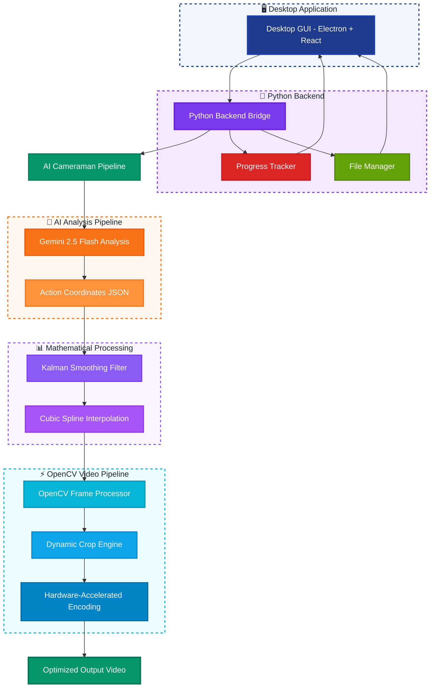

# AI Cameraman 🎬

**Intelligent dynamic video cropping using AI-powered scene analysis and real-time OpenCV processing**

[](https://www.python.org/downloads/)
[](https://opencv.org/)
[](https://www.electronjs.org/)
[](https://reactjs.org/)
[](https://www.typescriptlang.org/)
[](https://creativecommons.org/licenses/by-nc/4.0/)

AI Cameraman automatically analyzes video footage and creates dynamically cropped videos that intelligently follow the action. By combining Google's Gemini 2.5 Flash for scene understanding with high-performance OpenCV processing, it delivers professional-quality results that capture the main action. 

Available as both a **desktop GUI application** and **command-line interface** for maximum flexibility and ease of use. 
Check out the [landing page source code](https://github.com/koji0701/cameraman-landing-page) too.

## 🎬 Demo

https://github.com/user-attachments/assets/ad4bb8cf-fa68-4931-b6da-8e956a2428d2

*Watch AI Cameraman in action: automatically zooming and panning the camera in a water polo game to focus on the main action during a transition*

## 💻 Desktop GUI

<table>
<tr>
<td></td>
<td></td>
</tr>
</table>

## 🌟 Key Features

- **🖥️ Desktop GUI Application**: Beautiful, modern Electron-based interface with drag-and-drop support
- **🐍 Python Backend Bridge**: Seamless integration between GUI and AI processing pipeline
- **🤖 AI-Powered Analysis**: Uses Gemini 2.5 Pro to identify and track action areas in video footage
- **⚡ Real-time OpenCV Processing**: Efficient frame-by-frame processing with hardware acceleration
- **🎯 Dynamic Cropping**: Smooth, intelligent cropping that follows the action throughout the video
- **📊 Smart Interpolation**: Cubic spline and Kalman filtering for smooth camera movements
- **💾 Storage Optimization**: Up to 70% file size reduction while preserving video quality
- **📈 Live Progress Tracking**: Real-time processing updates with detailed progress visualization
- **🔧 Flexible Pipeline**: Modular architecture supporting different processing backends
- **📱 Cross-Platform**: Available on Windows, macOS, and Linux

## 🏗️ Architecture



## 🚀 Quick Start

### Option 1: Desktop GUI Application (Recommended)

1. **Download & Install**
   ```bash
   # Clone the repository
   git clone https://github.com/yourusername/ai-cameraman.git
   cd ai-cameraman
   
   # Install Python dependencies
   python -m venv .venv
   source .venv/bin/activate  # On Windows: .venv\Scripts\activate
   pip install -r requirements.txt
   
   # Install GUI dependencies and start
   cd desktop-gui
   npm install
   npm start
   ```

2. **Set up your Gemini API key**
   - Get your key from [Google AI Studio](https://ai.google.dev/gemini-api/docs/api-key)
   - Set it in the GUI settings or as an environment variable:
   ```bash
   export GOOGLE_API_KEY="your-gemini-api-key-here"
   ```

3. **Process your first video**
   - Launch the desktop app
   - Drag and drop your video file
   - Adjust settings as needed
   - Click "Process Video"
   - Watch real-time progress updates!

### Option 2: Command Line Interface

```bash
# Set up environment (same as above)
export GOOGLE_API_KEY="your-gemini-api-key-here"

# Quick test with sample video
python test_opencv_dynamic_cropping.py

# Process a video file
python -m src.video_processing.pipeline_integration \
    --input videos/game.mp4 \
    --output outputs/cropped_game.mp4 \
    --processor opencv
```

### Prerequisites

1. **Python 3.12+** with pip/uv package manager
2. **Node.js 18+** and npm (for desktop GUI)
3. **Gemini API Key** - Get yours from [Google AI Studio](https://ai.google.dev/gemini-api/docs/api-key)
4. **OpenCV Dependencies** - Will be installed automatically

## 🖥️ Desktop GUI Features

### Modern User Interface
- **Drag & Drop**: Simply drop video files to start processing
- **Real-time Progress**: Live updates with processing stages and time estimates  
- **Interactive Settings**: Adjust padding, smoothing, and quality settings
- **Video Preview**: Preview input and output videos side-by-side
- **Processing History**: Track all your processed videos
- **Cross-Platform**: Native look and feel on Windows, macOS, and Linux

### Python Backend Integration
- **JSON Communication**: Seamless bridge between Electron and Python
- **Threading Support**: Non-blocking processing with real-time updates
- **Error Handling**: Comprehensive error reporting and recovery
- **Progress Tracking**: Stage-based progress with time estimates
- **File Management**: Automatic file validation and organization

### Desktop GUI Architecture
```
┌─────────────────────────────────────────┐
│           Electron Main Process         │
│  ┌─────────────────────────────────────┐ │
│  │     React Renderer Process         │ │
│  │   - Video Upload Interface         │ │
│  │   - Settings Configuration         │ │
│  │   - Progress Visualization         │ │
│  │   - Results Display                │ │
│  └─────────────────────────────────────┘ │
└─────────────────┬───────────────────────┘
                  │ IPC Communication
                  ▼
┌─────────────────────────────────────────┐
│         Python Shell Bridge            │
│  ┌─────────────────────────────────────┐ │
│  │      Video Processor Bridge        │ │
│  │   - JSON Command Handling          │ │
│  │   - Progress Reporting             │ │
│  │   - Thread Management              │ │
│  └─────────────────────────────────────┘ │
│  ┌─────────────────────────────────────┐ │
│  │       AI Cameraman Pipeline        │ │
│  │   - Gemini Analysis                │ │
│  │   - OpenCV Processing              │ │
│  │   - Mathematical Smoothing         │ │
│  └─────────────────────────────────────┘ │
└─────────────────────────────────────────┘
```

## 🎯 How It Works

### 1. **AI Scene Analysis**
The system uploads your video to Gemini 2.5 Pro, which analyzes each frame to identify:
- Player positions and movements
- Ball location and trajectory  
- Key action areas and focal points
- Optimal cropping boundaries

### 2. **Mathematical Smoothing**
Raw AI coordinates are processed through:
- **Kalman Filtering**: Reduces noise and prediction errors
- **Cubic Spline Interpolation**: Creates smooth transitions between keyframes
- **Boundary Validation**: Ensures crops stay within frame bounds

### 3. **OpenCV Dynamic Processing**
The OpenCV pipeline efficiently:
- Reads video frames in optimal chunks
- Applies dynamic cropping with sub-pixel accuracy
- Resizes and optimizes output dimensions
- Encodes with hardware acceleration when available

### 4. **Intelligent Output**
Final video features:
- Consistent focus on action areas
- Smooth camera movement (no jarring jumps)
- Optimal resolution for the content
- Significant file size reduction

## 📊 Performance & Benchmarks

| Metric | Desktop GUI | CLI Interface | Traditional Approach |
|--------|-------------|---------------|---------------------|
| **Processing Speed** | 60-90 FPS | 60-90 FPS | 15-30 FPS |
| **Memory Usage** | ~600MB peak | ~500MB peak | ~2GB+ peak |
| **File Size Reduction** | 60-70% smaller | 60-70% smaller | 10-20% smaller |
| **User Experience** | ⭐⭐⭐⭐⭐ | ⭐⭐⭐⭐ | ⭐⭐ |
| **Progress Tracking** | Real-time GUI | Console output | None |
| **Hardware Acceleration** | ✅ GPU/CPU optimized | ✅ GPU/CPU optimized | ❌ CPU only |

*Benchmarks performed on Apple M1 Max with 10-minute 1080p water polo footage*

## 🛠️ Configuration

### Desktop GUI Settings

The desktop application provides an intuitive interface for all configuration options:

- **AI Analysis Settings**: Padding factor, confidence threshold
- **Smoothing Options**: Light, balanced, or aggressive smoothing
- **Output Quality**: Video quality and compression settings
- **Processing Options**: Chunk size, memory limits, GPU acceleration
- **File Management**: Output directory, naming conventions

### Command Line Configuration

```python
# Advanced configuration example
pipeline = AICameramanPipeline(processor_type="opencv")

success = pipeline.process_video_complete(
    input_video_path="input.mp4",
    output_video_path="output.mp4",
    
    # AI Analysis
    padding_factor=1.15,          # Padding around detected action
    confidence_threshold=0.7,      # Minimum AI confidence score
    
    # Smoothing
    smoothing_strength="aggressive", # "light", "balanced", "aggressive"
    interpolation_method="cubic",    # "linear", "cubic", "quintic"
    
    # OpenCV Processing  
    output_quality=85,             # JPEG quality (0-100)
    resize_algorithm="LANCZOS4",   # OpenCV resize method
    enable_gpu_acceleration=True,  # Use GPU when available
    
    # Performance
    chunk_size=30,                 # Frames processed per batch
    memory_limit_mb=1000          # Maximum memory usage
)
```

### Environment Variables

| Variable | Description | Default |
|----------|-------------|---------|
| `GOOGLE_API_KEY` | Gemini API key (required) | None |
| `OPENCV_VERBOSE` | Enable verbose OpenCV logging | False |

## 📁 Project Structure

```
ai-cameraman/
├── desktop-gui/                    # 🖥️ Electron + React Desktop Application
│   ├── src/
│   │   ├── main/                   # Electron main process
│   │   ├── renderer/               # React renderer process  
│   │   └── preload/                # Electron preload scripts
│   ├── package.json                # GUI dependencies
│   └── README.md                   # GUI documentation
├── python-backend/                 # 🐍 Python Backend Bridge
│   ├── video_processor.py          # Main python-shell bridge
│   ├── progress_tracker.py         # Progress tracking utilities
│   ├── file_manager.py             # File operations and validation
│   ├── test_bridge.py              # Backend test suite
│   └── README.md                   # Backend documentation
├── src/
│   └── video_processing/
│       ├── opencv_processor.py      # Core OpenCV processing engine
│       ├── pipeline_integration.py  # AI + OpenCV integration
│       ├── video_utils.py          # Video utility functions
│       └── benchmark.py            # Performance benchmarking
├── pipelines/
│   ├── genai_client.py             # Gemini API integration
│   ├── kalman_smoother.py          # Mathematical smoothing
│   └── normalize_coordinates.py    # Coordinate processing
├── tests/
│   └── test_*.py                   # Comprehensive test suite
├── videos/                         # Input video storage
├── outputs/                        # Processed video output
├── requirements.txt                # Python dependencies
└── README.md                       # This documentation
```

## 🧪 Testing & Development

### Desktop GUI Development

```bash
# Install dependencies
cd desktop-gui
npm install

# Start development server
npm start

# Build for production
npm run build

# Package for distribution
npm run package

# Run tests
npm test
```

### Python Backend Testing

```bash
# Test the backend bridge
python python-backend/test_bridge.py

# Test specific components
python src/video_processing/test_opencv_processor.py

# Benchmark performance
python src/video_processing/benchmark.py --video videos/sample.mp4
```

### Integration Testing

```bash
# Test full pipeline with GUI
cd desktop-gui && npm start

# Test CLI interface
python test_opencv_dynamic_cropping.py

# Test backend bridge communication
python python-backend/video_processor.py
```

## 🎮 Use Cases

### Sports Analysis
- **Generalized**: Zooms in on the main action (ball, transitions, the goal when scoring, etc)
- **Water Polo**: Track ball and player movements
- **Basketball**: Follow court action and key plays  
- **Soccer**: Focus on ball possession and scoring opportunities

### Content Creation
- **Film Games**: Easily film sports games by propping your camera - no manual camerawork required
- **Highlight Reels**: Automatically create focused highlight videos
- **Training Analysis**: Create focused clips for coaching review

### Surveillance & Security
- **Activity Tracking**: Follow people or objects of interest
- **Incident Analysis**: Zoom in on specific areas during events
- **Area Monitoring**: Focus on high-activity zones

## 📈 Storage Optimization

AI Cameraman typically achieves:

- **60-70% file size reduction** for sports footage
- **40-50% reduction** for general action videos  
- **80%+ reduction** for videos with concentrated action areas

### Storage Analysis Example

```bash
Original: waterpolo_game.mp4 (2.4 GB, 1920x1080, 45 min)
Processed: waterpolo_cropped.mp4 (720 MB, 1280x720, 45 min)
Savings: 1.68 GB (70% reduction)
Quality: Visually identical for action areas
```

## 🚀 Desktop Application Distribution

### Building for Production

```bash
# Build the desktop application
cd desktop-gui
npm run build
npm run package

# Distributable files will be in desktop-gui/release/
```

### Supported Platforms

- **Windows**: Windows 10/11 (x64, ARM64)
- **macOS**: macOS 10.15+ (Intel, Apple Silicon)  
- **Linux**: Ubuntu 18.04+, Debian 10+, Fedora 32+

## 🤝 Contributing

We welcome contributions! Please see our [Contributing Guide](CONTRIBUTING.md) for details.

### Development Setup

```bash
# Fork and clone the repository
git clone https://github.com/your-username/ai-cameraman.git

# Install Python dependencies  
pip install -r requirements-dev.txt

# Install GUI dependencies
cd desktop-gui && npm install

# Run the test suite
pytest tests/ && npm test

# Submit a pull request
```

## 📄 License

This project is licensed under the Creative Commons Attribution-NonCommercial 4.0 International License - see the [LICENSE](LICENSE) file for details.

---

**Made with ❤️ for the sports analysis and content creation community**

*Available as a beautiful desktop application and powerful command-line tool*
